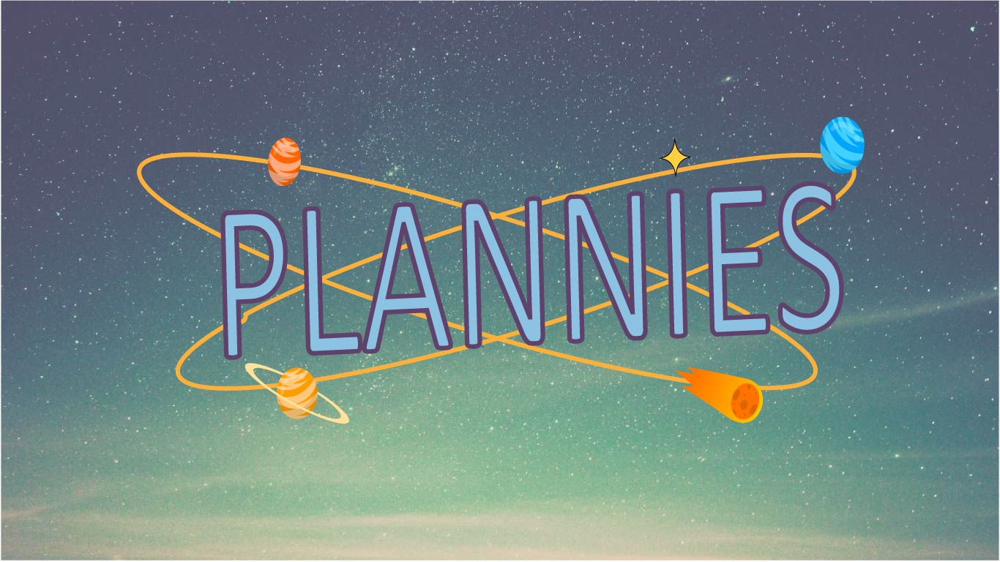
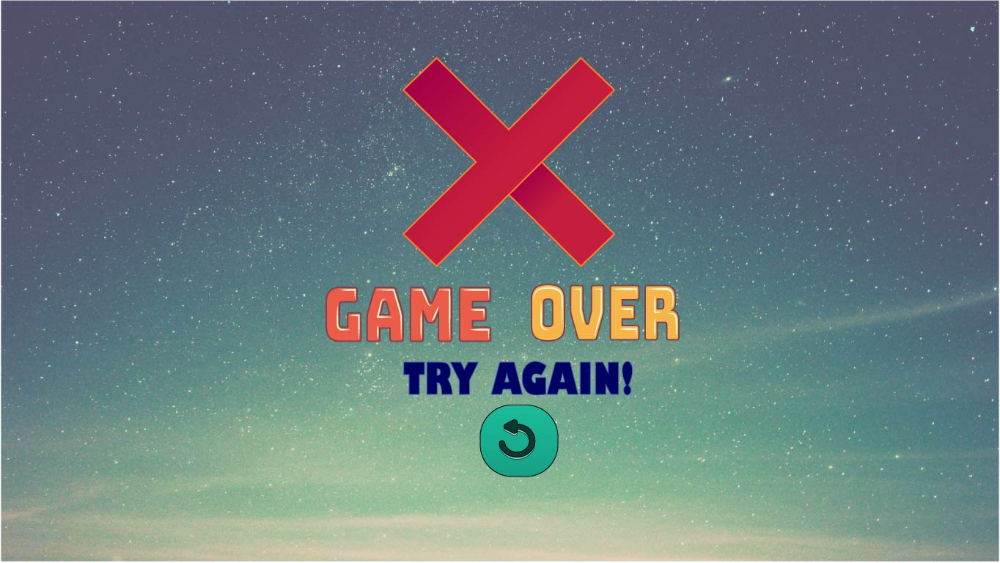
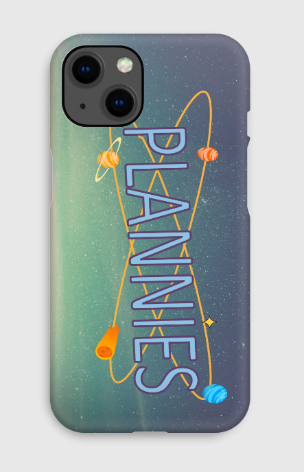

# PLANNIES

## No que consiste o jogo?

•	Com o tema do sistema solar, o jogo Plannies gira em torno de uma astronauta que possui a missão de capturar os planetas desde Neptuno até ao Sol. É importante tentar evitar todos os obstáculos que se encontram ao logo do jogo de forma a chegar ao destino final.

## Como jogar?
•	O jogo funciona apenas com um clique, o jogador necessita de continuar a premir o ecrã de forma a evitar que a astronauta embata contra os obstáculos e capture todos os planetas.
•	Sempre que se choca contra um obstáculo o jogo termina e regressa ao início. Quando se chega ao Sol o jogo dá-se por terminado, indicando ao jogador que obteve a vitória.

 
 

## Como forma de divulgação elaboramos uma capa de telemóvel com o tema do jogo.

## Para saber um pouco mais sobre Plannies, visualize o seguinte video: 

https://youtu.be/hw7RePrMnC0

## Trabalho elaborado por: Ana Margarida Gonçalves, Catarina Palmela, Diana Almeida PME2
